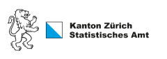

<style type="text/css">
.main-container {
  max-width: 1800px;
  margin-left: 0;
  margin-right: auto;
}
blockquote {
    padding: 10px 20px;
    margin: 0 0 20px;
    font-size: 14px;
    border-left: 5px solid #eee;
}

h1.title {
  font-size: 38px;
  color: #000000;
  }
  
h1 { /* Header 1 */
  font-size: 28px;
  color: #0033cc;
}
h2 { /* Header 2 */
    font-size: 28px;
	color: #0099ff
}
h3 { /* Header 3 */
    font-size: 14px;
	color: #6600cc
}
</style>




# Ziel des Projekts

Das Monitoring bündelt tagesaktuelle Datenreihen, welche die Entwicklungen beleuchten sollen, die durch die Corona-Krise in allen Lebensbereichen ausgelöst werden. So geben beispielsweise die täglich aktualisierten Daten des COVID19-Mobilitätsmonitorings Auskunft darüber, in welchem Ausmass die Bevölkerung wegen der Verordnungen des Bundesrats ihre Tagesdistanz verringert hat. Ziel des Projekts ist es, möglichst viele der in Verwaltung und Wirtschaft und der OGD-Community erzeugten Zeitreihen zu sammeln und konsolidiert in einem einheitlichen Format und in einem Datensatz so rasch wie möglich öffentlich zugänglich zu machen, und dann im Tagesrhythmus auch zu aktualisieren. So entsteht ein umfassendes Bild davon, wie sich das Verhalten der Akteure in der aktuellen Krisensituation verändert, und wie die Entwicklungen in den unterschiedlichen Lebensbereichen miteinander zusammenhängen. Nicht zuletzt kann das "Gesellschaftsmonitoring COVID19" so auch die Evaluation der Wirksamkeit der behördlichen Massnahmen gegen die Ausbreitung des Corona-Virus' unterstützen.


<span style="color:#0033cc">**Zusammenarbeit zwischen Staat und Privaten**</span> <br>
Je schneller der Datensatz wächst, und je mehr unterschiedliche Lebensbereiche darin gespiegelt sind, desto wertvoller ist er. Deshalb hat das Statistische Amt des Kantons Zürich zahlreiche potentielle Datenhalter um Unterstützung gebeten: Andere Verwaltungsstellen, Hochschulinstitute, Firmen und engagierte Privatpersonen wurden angefragt, relevantes Datenmaterial zur Verfügung zu stellen. An dieser Stelle allen Beitragenden herzlichen Dank für die grosse Hilfsbereitschaft trotz der oft hohen Belastung durch das Tagesgeschäft in der Krise! Weitere Vorschläge werden gerne entgegengenommen.


Das Gesellschaftsmonitoring COVID19 ist ein work in progress: Anregungen, Beiträge, Kritik sind willkommen!

Mehr Informationen zu diesem Projekt finden Sie [hier](https://bit.ly/2UbzLdv).


# Kontakt:

**Twitter:** @[statistik_zh](https://twitter.com/statistik_zh)


**wissenschaftliche Projektleitung:** Dr. Peter Moser, Stv. Amtschef Statistisches Amt des Kantons Zürich, Abteilungsleiter Analysen & Studien Tel: 043 259 75 35

<<<<<<< HEAD
**Technische Projektleitung:** Katharina Kälin, wissenschaftliche Mitarbeiterin, Statistisches Amt des Kantons Zürich Tel: 043 259 75 08

=======
Dr. Peter Moser, Stv. Amtschef Statistisches Amt des Kantons Zürich, Abteilungsleiter Analysen & Studien Tel: 043 259 75 35

**Technische Projektleitung**

Katharina Kälin, wissenschaftliche Mitarbeiterin, Statistisches Amt des Kantons Zürich Tel: 043 259 75 08

>>>>>>> b668499a1743787edd456495c6547771c31b9556
# Datenbezug:

Die Daten können unter folgendem Link bezogen werden: <br>
https://raw.githubusercontent.com/statistikZH/covid19monitoring/master/covid19socialmonitoring.csv

<span style="color:#0033cc">**> Erläuterungen zur Struktur der Daten**</span> <br>
Eine eindeutige Variablenbezeichnung, die auf eine Zeitreihe verweist, ergibt sich aus der Kombination von "variable_short bzw. "variable_long" und location, da einige Indikatoren regionalisiert sind.

<span style="color:#0033cc">**> Zitiervorschlag**</span> <br>
Ursprüngliche Datenherkunft (intervista, SIX, Flughafen Zürich etc.) / "Gesellschaftsmonitoring Covid-19 STAT"


<!-- **Darstellung der Indikatoren:** -->

<!-- https://observablehq.com/@mmznrstat/monitoring-covid19-effekt -->


# Indikatorenübersicht:

```{r, message=FALSE, warning=FALSE, echo = FALSE}

library(DT)

metadata <- read.csv("./Metadata.csv", header=T, sep=",", stringsAsFactors=FALSE, encoding="UTF-8")
metadata_sel <- metadata[which(metadata$public == "ja"), ! names(metadata) %in% c("variable_short", "unit", "description", "public")]

datatable(metadata_sel[order(metadata_sel$topic), ], options = list(pageLength = 10), filter = 'top' , escape = FALSE, rownames = FALSE)

```


