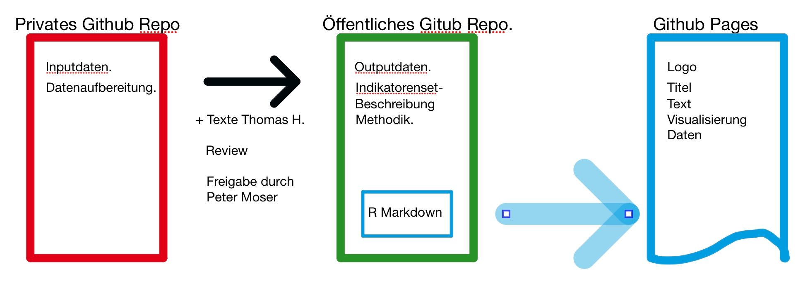

# Table of Content
- [Aim](https://github.com/statistikZH/covid19monitoring/tree/master#aim)  
- [Gitrepos overview](https://github.com/statistikZH/covid19monitoring/tree/master#gitrepos-overview)  
- [Our github procedure](https://github.com/statistikZH/covid19monitoring#our-github-procedure)  
- [Naming convention for scripts](https://github.com/statistikZH/covid19monitoring/tree/master#naming-convention-for-scripts)  
- [Naming convention for gitrepos folders](https://github.com/statistikZH/covid19monitoring/tree/master#naming-convention-for-gitrepos-folders)  
- [Naming convention for gitrepos folders](https://github.com/statistikZH/covid19monitoring/tree/master#naming-convention-for-scripts)  
- [Data structure specification for output data](https://github.com/statistikZH/covid19monitoring/tree/master#data-structure-specification-for-output-data)  
- [Metadata](https://github.com/statistikZH/covid19monitoring/tree/master#metadata)  
- [Template for GitHub Pages](https://github.com/statistikZH/covid19monitoring/blob/master/README.md#tempalte-for-github-page)  

# Aim
«Gesellschaftsmonitoring COVID19» 

Das Monitoring bündelt tagesaktuelle Datenreihen, welche die Entwicklungen beleuchten sollen, die durch die Corona-Krise in allen Lebensbereichen ausgelöst werden. So geben beispielsweise die täglich aktualisierten Daten des COVID19 Mobilitätsmonitorings Auskunft darüber, in welchem Ausmass die Bevölkerung wegen der Verordnungen des Bundesrats ihre Tagesdistanz verringert hat. Ziel des Projekts ist es, möglichst viele der in Verwaltung und Wirtschaft und der OGD-Community erzeugten Zeitreihen zu sammeln und konsolidiert in einem einheitlichen Format und in einem Datensatz so rasch wie möglich öffentlich zugänglich zu machen. Dies verschafft allen Interessierten einen Überblick darüber, wie sich die Bevölkerung in der aktuellen Krisensituation verhält. Das Monitoring kann auch dabei helfen, die Wirksamkeit der behördlichen Massnahmen gegen die Ausbreitung des Corona-Virus' zu evaluieren.

Zusammenarbeit zwischen Staat und Privaten

Je schneller der Datensatz wächst, und je mehr Lebensbereiche darin gespiegelt werden, desto wertvoller ist es. Deshalb hat das Statistische Amt zahlreiche potentielle Datenhalter um Unterstützung gebeten: Andere Verwaltungsstellen, Hochschulinstitute, Firmen und engagierte Privatpersonen wurden angefragt, relevantes Datenmaterial zur Verfügung zu stellen. An dieser Stelle herzlichen Dank für die grosse Hilfsbereitschaft trotz der teils hohen Belastung durch das Tagesgeschäft in der Krise! Weitere Vorschläge werden gerne entgegengenommen

Das Gesellschaftsmonitoring COVID19 ist ein work in progress: Anregungngen, Beiträge, Kritik ist willkommen!
Mehr dazu: [here](https://bit.ly/2UbzLdv)

Kontakt für Auskünfte zum Projekt:

Wissenschaftlich–fachliche Aspekte:

Dr. Peter Moser, Stv. Amtschef Statistisches Amt des Kantons Zürich, Leiter Analysen & Studien (043 259 75 35)

technische Aspekte:

Katharina Kälin, wissenschaftliche Mitarbeiterin Statistisches Amt des Kantons Zürich (043 259 75 08) 

# Gitrepos overview

## Private gitrepos

| gitrepos Name  | Data ok |Plots ok|Text ok|Peter Moser ok|
| ------------- | ------------- |------------|------------|------------
| [covid19monitoring_other_Weather](https://github.com/statistikZH/covid19monitoring_other_Weather)  |   | | ||
| [covid19monitoring_mobility_PrivateTransport](https://github.com/statistikZH/covid19monitoring_mobility_PrivateTransport)   |   ||||
| [covid19monitoring_mobility_SlowTraffic](https://github.com/statistikZH/covid19monitoring_mobility_SlowTraffic)   |   ||||
| [covid19monitoring_mobility_intervista](https://github.com/statistikZH/covid19monitoring_mobility_intervista)   |   ||||
| [covid19monitoring_economy_SMI](https://github.com/statistikZH/covid19monitoring_economy_SMI)   |   ||||
| [covid19monitoring_economy_FlightTraffic](https://github.com/statistikZH/covid19monitoring_economy_FlightTraffic)   |  ||||
  
## Public gitrepos
   
| gitrepos Name | 
| ------------- | 
|  None at the moment |

**"Data ok" means**: 
-  Data follows specification of Data structure specification for output 
-  Data is validated

**"Plot ok" means**: 
-  Plot is created 
-  Plot is validated

**"Text ok" means**: 
-  Thomas Hofer has created Text

**"Peter Moser ok" means**: 
-  Non sensitive data can be published to public repository 

# Our github procedure 

## > gitrepos with no data protection
1. Create private repository  
2. As soon as Peter Moser gives his ok, tranform your private repository into a public repository: 
> Settings -> Danger Zone -> Make this repository public

## > gitrepos with data protection
1. Create private repository  (named *+ _ + private*; see naming convention below)  
2. As soon as Peter Moser gives his ok, create a 2nd gitrepos that has the same name but without the *+ _ + private* string in the end. Here, you only copy the non-sensitive data from step 1. 

# Naming convention for gitrepos folders

## > gitrepos  with data protection
covid19monitoring  + _ +   topic (start with lowercase)  + _ +  NameOfDataset (CamelCase) 
> E.g.: covid19monitoring_mobility_SlowTraffic

## > gitrepos  with data protection
covid19monitoring  + _ +   topic (start with lowercase)  + _ +  NameOfDataset (CamelCase) **+ _ + private**  
> E.g.: covid19monitoring_mobility_SlowTraffic_private

# Naming convention for scripts

topic (start with uppercase) + _ +  NameOfDataset (CamelCase)  
> E.g.: Mobility_SlowTraffic

For some data it might be nice to additionally prove a more compact dataset (subset) so that the data user can get a quick insight. 
Please use the following naming convention for this more compact datasets: 
Name of regular dataset (as described above) + _ + subset

# Data structure specification for output data

**Encoding** 
UTF-8  

**Tab separator** 
","  

**Variables** 
See [the spreadsheet](https://docs.google.com/spreadsheets/d/16bmV79jLgKt_miaFbQpSAcGBkqYA0pWXbmFviaTZUuk/edit#gid=0). 

# Metadata

The metadata is documented [here](https://docs.google.com/spreadsheets/d/1AXn18Cz-DJATHCsc_zfyHReWdK0FGjbcbLxxIgjGulg/edit#gid=2058194538).

# Template for GitHub Page

The template for our GitHub Page can be found [here](https://github.com/statistikZH/covid19monitoring/blob/master/Template_GitHubPages.Rmd). This template generates the following [GitHub Pages](https://statistikzh.github.io/covid19monitoring/). 

# Metadata for gitrepos folders

**Author**: Name and Surname  
**Methodology**: Brief description of how the dataset is created  
**Dataset**: Path to dataset that is created in this gitrepos  
**Source**: Source of dataset  
**Frequency of update**: E.g. daily/weekly/monthly  
**Please consider these points when using the dataset**: 
Möglicher Quellenverweis:  Originalquelle (z.B Intervista AG, Tiefbauamt Stadt Zürich, Flughafen Zürich etc); Gesellschaftsmonitoring Covid-19 STAT
. 

